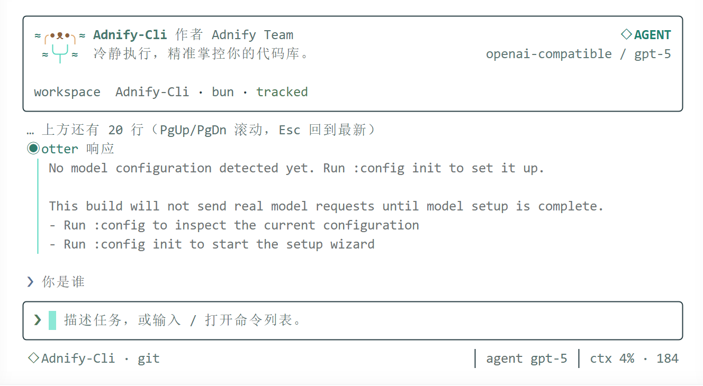

<div align="center">

# 🦦 Adnify-Cli

**Command AI Into Real Work.**

A branded AI coding terminal built for real-world engineering delivery.

Built on `Bun + TypeScript + Ink`. Not a web chat ported into the terminal, but a stable, clear, and sustainably evolving engineering workspace that integrates sessions, commands, configuration, recovery, persistence, and Agent capabilities.

[Quick Start](#-quick-start) · [Features](#-features) · [Tools & Approval](#️-tools--approval) · [Configuration](#-configuration) · [Architecture](#-architecture)



</div>

---

## ✨ Features

### Three Working Modes

| Mode | Description |
|---|---|
| **Chat** | Everyday Q&A and code discussion |
| **Agent** | Multi-turn tool calling with automatic file I/O, command execution, and code search |
| **Plan** | Plan first, execute later — ideal for complex tasks |

### Core Capabilities

- **Streaming Responses** — Real-time output with stable, low-jitter terminal rendering
- **Session Persistence** — Per-workspace session files, auto-restore on startup
- **Closed-Loop Tool Calling** — 8 built-in tools + dynamic MCP tools, with progress and results flowing back into the session
- **Risk-Tiered Approval** — Pauses before file writes and command execution for user confirmation
- **Cross-Session Memory** — `:memory` stores project knowledge, auto-injected into future sessions
- **Checkpoints & Undo** — `:checkpoint` / `:undo` / `:restore` with Git-independent file-level snapshots
- **Context Window Diagnostics** — `:context` for real-time message count, token estimation, and health
- **Bilingual i18n** — Switch between Chinese and English interface
- **Prompt Pack Driven** — System prompts, tool definitions, and command definitions are maintainable and replaceable
- **Original Otter Branding** — Deep river theme palette with a unique mascot identity

---

## 🎮 Terminal Interaction

| Key | Behavior |
|---|---|
| `Ctrl+O` | Open / close fullscreen transcript |
| `PgUp / PgDn` | Scroll long conversations one viewport at a time |
| `Esc` | Abort active work; return to bottom while browsing; exit transcript when at bottom |
| `Tab / Enter` | Fill in command from the panel without executing |

- Regular conversations show compact tool summaries; full inputs, outputs, and elapsed time available in fullscreen transcript
- Approval and configuration prompts automatically exit transcript mode to keep critical actions visible

---

## 🛠️ Tools & Approval

### Built-in Tools

| Tool | Capability | Risk |
|---|---|---|
| `workspace-read` | Read workspace summary | 🟢 safe |
| `search-index` | ripgrep-based code search (falls back to built-in scanner) | 🟢 safe |
| `glob-search` | Glob-pattern file matching | 🟢 safe |
| `file-ops` | `read` / `list` / `write` / `update` / `patch` | 🟢 read safe · 🟡 write careful |
| `shell-runner` | Whitelist command execution | 🟢 read-only safe · 🟡 verification careful |
| `web-search` | DuckDuckGo public web search (no API key needed) | 🟡 careful |
| `web-fetch` | Fetch and extract text from an HTTP(S) URL | 🟡 careful |
| `task` | Dispatch up to 8 parallel subtasks with progress streaming | 🟡 careful |
| `mcp__*` | Invoke tools from connected MCP servers | 🟡 careful |

### Approval Mechanism

File writes and verification commands are not decided by the model alone. Execution pauses before actual disk writes / execution, triggering an approval panel displaying the tool name, risk level, operation summary, and target path:

| Key | Behavior |
|---|---|
| `y` | Approve this instance |
| `n` | Reject; rejection reason is returned to the model to adjust its approach |
| `a` | Always allow this tool within the current session |

> `allowWrite: true` in tool descriptions is merely a self-declaration by the model — the model can bypass it with a few extra keystrokes. The true permission boundary must rest on user keystrokes.

---

## ⚡ Quick Start

```bash
# Install dependencies
bun install

# Development mode
bun run dev

# Build
bun run build

# Test
bun test

# Verify (tests + type check + build)
bun run verify
```

---

## ⚙️ Configuration

### Environment Variables

| Variable | Description |
|---|---|
| `ADNIFY_PROVIDER` | Model provider |
| `ADNIFY_API_KEY` | API key |
| `ADNIFY_BASE_URL` | Custom API endpoint |
| `ADNIFY_MODEL` | Model name |
| `ADNIFY_LOCALE` | Interface language — `zh-CN` or `en` |
| `ADNIFY_HOME` | Application data directory (highest priority) |

### Recommended Configuration Commands

```
:config
:config init
:config set provider <value>
:config set model <value>
:config set api-key <value>
:config set base-url <value>
:config clear api-key
```

`:config init` enters a temporary input panel configuration mode without writing the configuration conversation into the session area.

---

## 💾 Data Storage

### Default Paths

| Platform | Path |
|---|---|
| **Windows** | `%APPDATA%\Adnify-Cli\settings.json` · `%LOCALAPPDATA%\Adnify-Cli` |
| **macOS** | `~/Library/Application Support/Adnify-Cli` |
| **Linux** | `$XDG_CONFIG_HOME/adnify-cli` · `$XDG_DATA_HOME/adnify-cli` |

### Data Directory Structure

```
Adnify-Cli/
├── config.json
├── sessions/
│   └── <sessionId>.json
└── memories/
    └── <workspace>.json
```

File-level write snapshots are stored in `.adnify/checkpoints/` within the workspace and do not require Git.

### Custom Data Directory

```
:storage              # View current data directory
:storage set <path>   # Migrate to a new directory (auto-migrates config and sessions)
:storage reset        # Reset to system default path
```

---

## 📋 Command Reference

### Session & Memory

```
:session              # Current session info
:sessions             # List all sessions
:resume [index|id]    # Resume a specific session
:memory [content]     # Save project memory
:memory list          # View memories
:memory clear         # Clear memories
:context              # Context window diagnostics
:clear                # Clear current session
:exit                 # Exit
```

### Mode & Tools

```
:mode chat | agent | plan
:workspace            # Current workspace info
:status               # Runtime status
:tools                # Available tools
:model [provider] [model]
```

### Checkpoints & Undo

```
:checkpoint [message] # Create checkpoint
:undo                 # Undo last checkpoint
:restore [id|index]   # Restore file-level snapshot
```

### Others

```
:help                 # Help
:doctor               # Environment diagnostics
:diff                 # View changes
:review               # Code review
:mcp                  # MCP server management
:skill [name|list]    # Skill management
```

---

## 🏗️ Architecture

### Tech Stack

| Layer | Choice |
|---|---|
| Runtime | Bun |
| Language | TypeScript |
| Terminal UI | [Ink](https://github.com/vadimdemedes/ink) + React |
| AI SDK | [Vercel AI SDK](https://sdk.vercel.ai/) |
| Architecture | DDD-style layered architecture |

### Layered Structure

```
src/
├── domain/            # Domain models, aggregate roots, value objects, domain behaviors
├── application/       # Use case orchestration, port definitions, DTOs, i18n
├── infrastructure/    # Model gateway, config I/O, storage, prompt loading, tool execution
└── presentation/      # Ink UI, interaction controllers, terminal layout, view components
```

### Design Principles

- **High Performance** — Stable terminal rendering, minimal jitter and re-renders
- **Loose Coupling** — Clear responsibilities across domain, application, infrastructure, and presentation layers
- **High Cohesion** — Sessions, config, storage, prompts, and command systems evolve independently
- **High Reusability** — Ports, use cases, Prompt Packs, storage parsers, and UI components are all reusable
- **Extensibility** — Clear entry points reserved for future Agent orchestration, multi-turn execution, and plugins

### Development Guidelines

The repository includes a `.rules/` directory to constrain collaboration methods, architectural boundaries, and delivery quality:

- [.rules/README.md](./.rules/README.md)
- [.rules/00-core.md](./.rules/00-core.md)
- [.rules/10-architecture.md](./.rules/10-architecture.md)
- [.rules/20-coding-style.md](./.rules/20-coding-style.md)
- [.rules/30-delivery-workflow.md](./.rules/30-delivery-workflow.md)
- [.rules/40-ai-collaboration.md](./.rules/40-ai-collaboration.md)

---

## 📈 Milestones

| Code | Goal | Status |
|---|---|---|
| **M1** | Session persistence and startup recovery | ✅ Complete |
| **M2** | Tool calling and Agent capabilities (8 built-in tools + MCP + 20-round Agent loop) | ✅ Complete |
| **M3** | Approval / Permissions / UI polish and productization | 🔨 In Progress |

---

## 📄 License

[MIT](./LICENSE) © 2026 adnaan

---

<div align="center">

**Adnify-Cli** — Like a product, not just a script. Like a workspace, not just a Q&A window.

Made with 🦦 by **adnaan**

</div>
